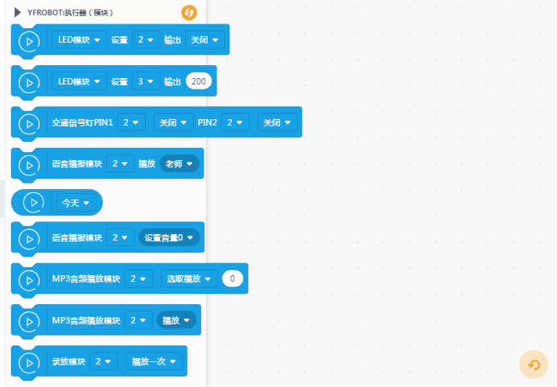

# YFROBOT ACTUATOR


---------------------------------------------------------

## 目录

* [相关链接](#相关链接)
* [描述](#描述)
* [积木列表](#积木列表)
* [示例程序](#示例程序)
* [许可证](#许可证)
* [支持列表](#支持列表)
* [更新记录](#更新记录)

## 相关链接
* 本项目加载链接: ```https://github.com/yfrobot/ext-oled12864```

* 用户库教程链接: ```https://mindplus.dfrobot.com.cn/extensions-user```

* 购买此产品: [YFROBOT商城](https://www.yfrobot.com/).

## 描述
支持YFROBOT 执行类模块：LED模块、蜂鸣器、风扇模块、振动模块、继电器、交通灯模块、语音播报模块、音频播放模块、录放模块。

## 积木列表




## 示例程序


## 许可证

MIT

## 支持列表

主板型号                | 实时模式    | ArduinoC   | MicroPython    | 备注
------------------ | :----------: | :----------: | :---------: | -----
arduino uno        |             |       √已测试       |             | 
micro:bit        |             |       √未测试       |             | 
mpython        |             |        √未测试      |             | 


## 更新日志
* V0.0.1  基础功能完成，Mind+V1.7.1 RC2.0版本软件测试